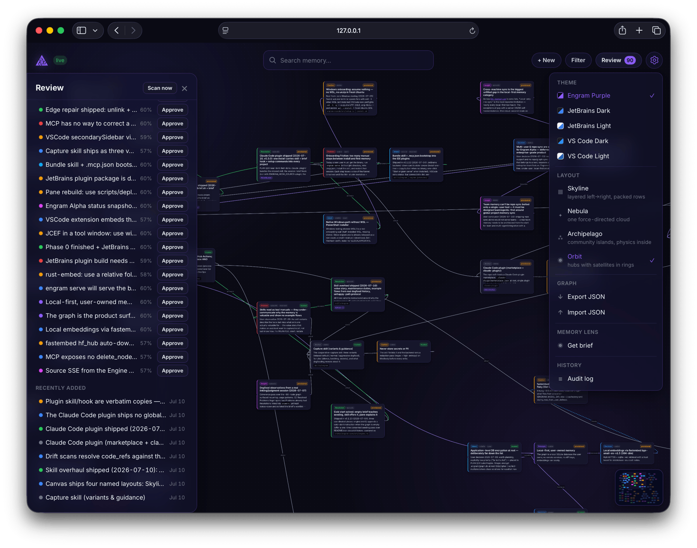
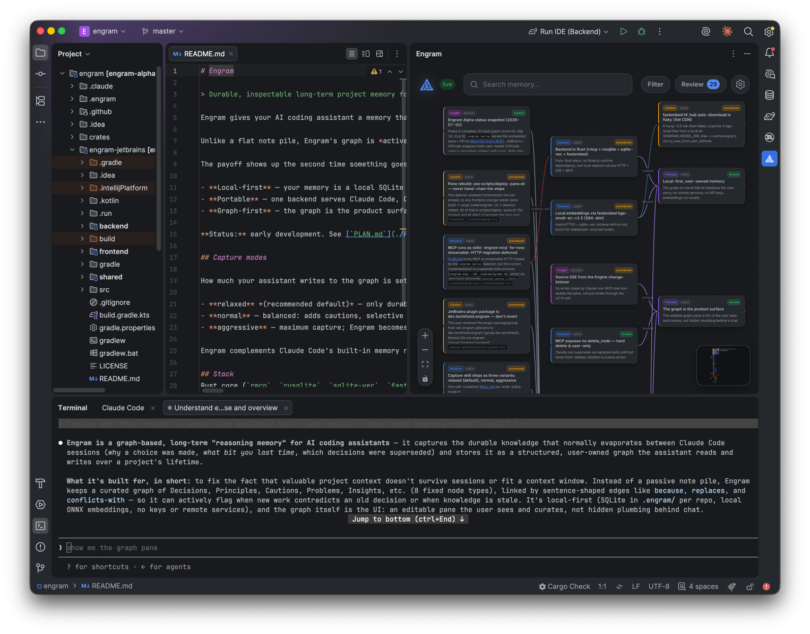
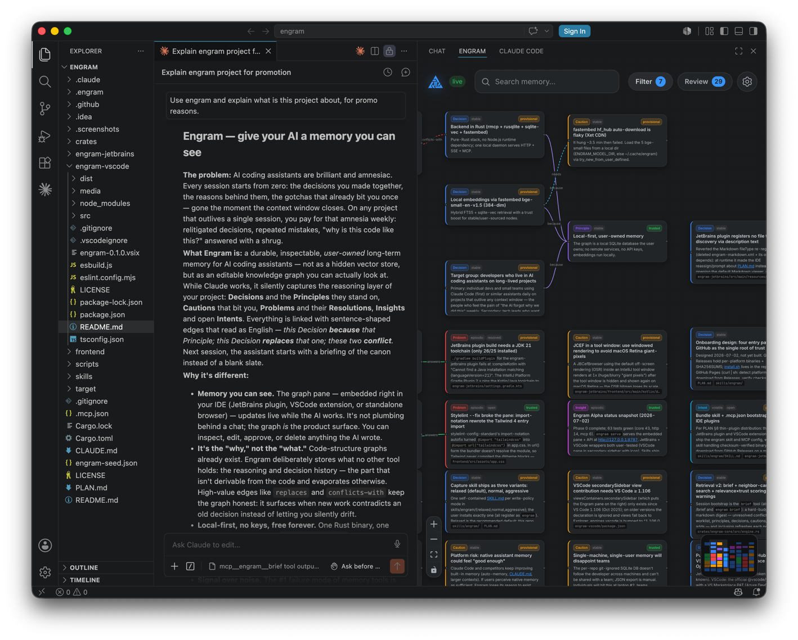

# Engram

[](https://github.com/techtheist/engram/actions/workflows/backend.yml)
[](https://github.com/techtheist/engram/actions/workflows/frontend.yml)
[](https://github.com/techtheist/engram/actions/workflows/jetbrains.yml)
[](https://github.com/techtheist/engram/actions/workflows/vscode.yml)
[](https://plugins.jetbrains.com/plugin/32654-engram)
[](https://marketplace.visualstudio.com/items?itemName=techtheist.engram-alpha)
[](https://open-vsx.org/extension/techtheist/engram-alpha)

> Durable, inspectable long-term project memory for AI coding assistants. Local-first, user-owned, graph-first.

Engram gives your AI coding assistant a memory that survives across sessions: a structured graph of your project's **principles, decisions, cautions, problems, resolutions, insights, and intents** — that the assistant reads from and writes to, and that **you can see, edit, and own**.



<details>
<summary><b>Inside JetBrains IDEs</b> — the same pane as a tool window, live next to your assistant <i>(click to expand)</i></summary>
<br>


</details>

<details>
<summary><b>Inside VS Code</b> — the pane in the secondary sidebar, watching the assistant work <i>(click to expand)</i></summary>
<br>


</details>

Unlike a flat note pile, Engram's graph is *active*: it tracks when knowledge is **superseded** (`replaces`) and when it **conflicts** (`conflicts-with`), and it knows which facts are durable vs. likely to go stale — so it doesn't rot.

The payoff shows up the second time something goes wrong. When your assistant gets stuck on a problem it has fought before — a flaky build step, a library quirk, a config trap — the graph already holds the artifacts from last time: the **Problem**, the **Resolution** that answered it, and the **Caution** that would have prevented it. Instead of rediscovering the fix from scratch, the assistant recalls it and applies it.

- **Local-first** — your memory is a local SQLite graph. No cloud, no keys.
- **Portable** — one backend serves Claude Code, Claude Desktop, and a browser UI via MCP + HTTP.
- **Graph-first** — the graph is the product surface, not hidden plumbing.

**Status:** early development. See [`PLAN.md`](./PLAN.md) for the full spec and roadmap.

## Install

From your project's root:

```sh
curl -fsSL https://raw.githubusercontent.com/techtheist/engram/main/install.sh | sh
```

This downloads the `engram` binary for your platform (checksum-verified, into `~/.local/bin`), wires the repo for Claude Code (`.mcp.json` + the capture skill), and git-ignores the personal `.engram/` graph. Then run `engram serve` and open `http://127.0.0.1:8787` — or use the [JetBrains plugin](https://plugins.jetbrains.com/plugin/32654-engram) or the VS Code extension ([VS Marketplace](https://marketplace.visualstudio.com/items?itemName=techtheist.engram-alpha) · [Open VSX](https://open-vsx.org/extension/techtheist/engram-alpha) for VSCodium/Cursor/Windsurf) instead of the browser.

**Windows:** run the same command inside **WSL2** — the script detects WSL and installs the native Windows binary (`engram.exe`), which WSL runs transparently. macOS arm64, Linux x64, and Windows x64 binaries are on [GitHub Releases](https://github.com/techtheist/engram/releases). Intel Macs: no prebuilt binary (onnxruntime upstream dropped Intel-mac builds) — `cargo install --path crates/engram-cli` from a checkout instead.

Options: `--skill relaxed|normal|aggressive` (capture intensity, default relaxed), `--bin-only`, `ENGRAM_VERSION=v0.1.2` to pin.

## Capture modes

How much your assistant writes to the graph is set by which **skill variant** you install — see [`skills/engram/`](./skills/engram/):

- **relaxed** *(recommended default)* — only durable, high-value knowledge; fewer, better nodes.
- **normal** — balanced: adds cautions, selective insights, finer-grained decisions.
- **aggressive** — maximum capture; Engram becomes the spine of the project's decision history (stale, unused nodes decay out).

Engram complements Claude Code's built-in memory rather than replacing it: it holds the project's *reasoning* — decisions, conflicts, gotchas — not session workflow or code structure.

## The ontology

Eight node types, each answering a different question about the project:

| Type | Holds |
|---|---|
| **Principle** | A stable preference or convention — *"local-first, no cloud"* |
| **Decision** | A choice made for a reason — *"Rust backend, because…"* |
| **Caution** | A gotcha or constraint that bit (or will bite) — *"relative `--db` creates an empty graph"* |
| **Problem** | Something that went wrong |
| **Resolution** | How a Problem was actually solved |
| **Insight** | A non-obvious realization worth carrying forward |
| **Intent** | A TODO or deferred idea that should survive the session |
| **Anchor** | A code subject other nodes attach to — *"the RAG layer"* |

Edges read as English sentences: a Decision **because** a Principle, a Resolution **answers** a Problem, an Insight **builds-on** another, any node **about** an Anchor. The two that keep the graph honest are **replaces** (supersession — old knowledge stays as history) and **conflicts-with** (an explicit, visible contradiction). There is deliberately no `relates_to`: if no real verb fits, the link doesn't belong.

## Trust & decay

Memory tools die from noise, so every node's **trust is computed live** from three timestamps — no background process has to run for the graph to stay honest:

- **Just written** → trust starts at **50%** and fades linearly toward 1% over half a year.
- **Surfaced by retrieval** (a search hit, the session brief) → the node proved useful; trust restarts at **60%** from that moment, fading on the same half-year curve. Knowledge that keeps getting used keeps itself alive.
- **Approved** — by you in the pane's review queue, or by the assistant *only on your explicit demand* → trust restarts at **100%** and fades slowly to a 20% floor over a year. Re-approve anytime to reset it.
- Below **30%** a node is **stale**: badged in the pane, flagged to the assistant in search results and the brief, and queued in Review for your verdict — refresh it, supersede it, or delete it. Nothing is ever silently removed; hard-delete stays yours alone.
- Search folds this in: results rank by relevance × trust, with a small recency bonus, so fresh, living knowledge wins near-ties against stale look-alikes.

The net effect: capture can be liberal, because whatever never proves useful quietly fades out of the way.

## Stack
Rust core (`rmcp`, `rusqlite`, `sqlite-vec`, `fastembed`) · Vue 3 + TypeScript + Vue Flow · JetBrains (JCEF) & VSCode (Webview) wrappers · MIT licensed.

## License
[MIT](./LICENSE)
