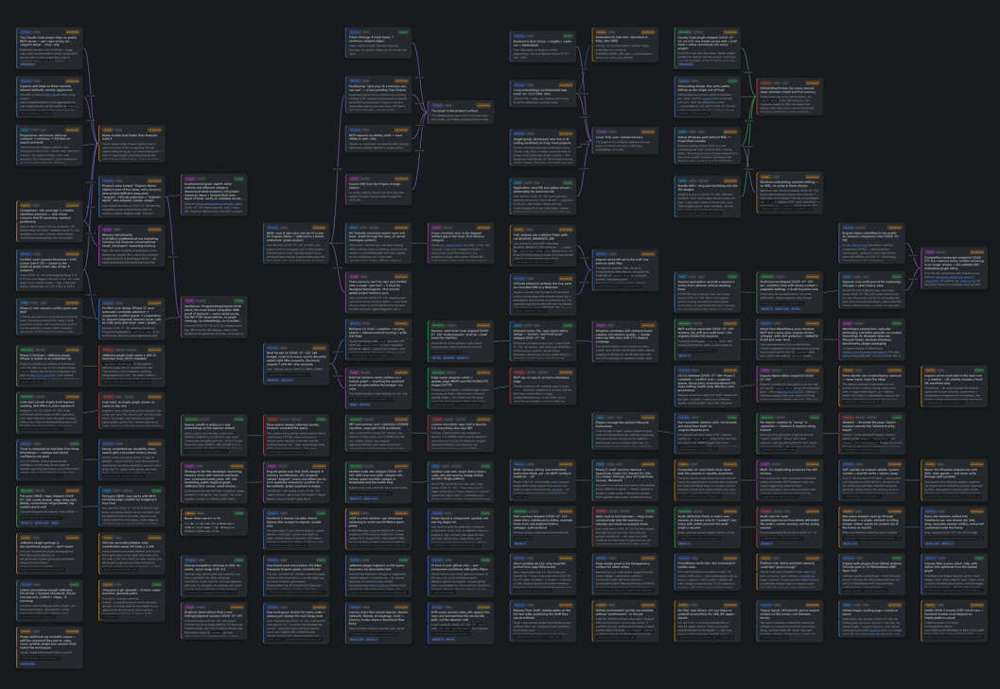
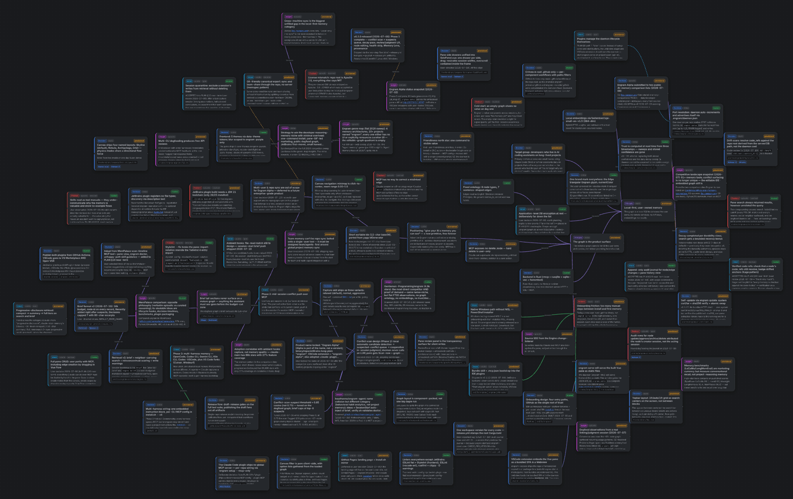
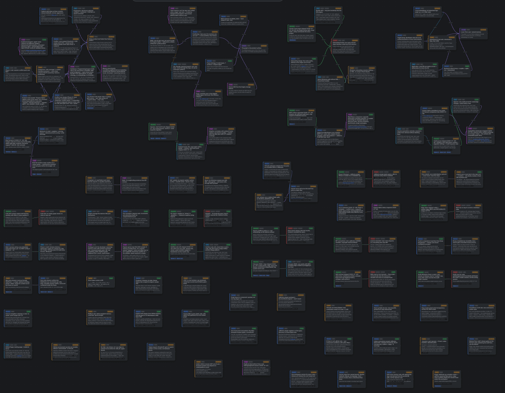
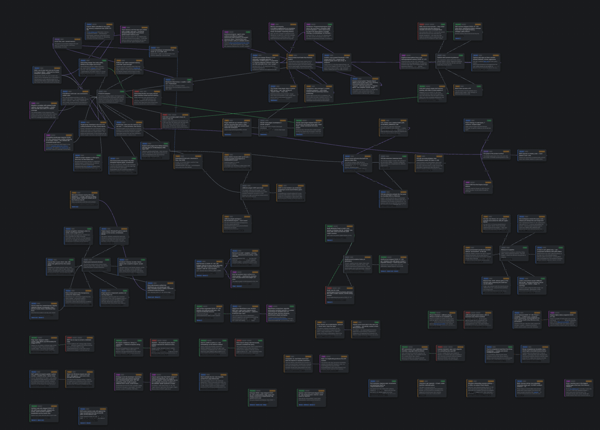
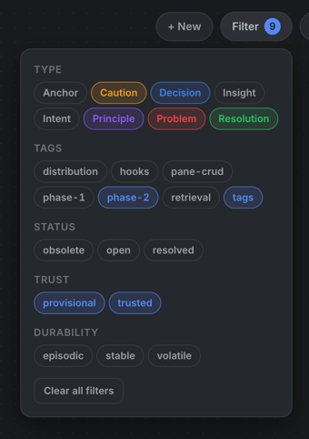
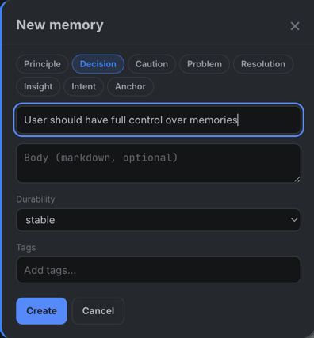
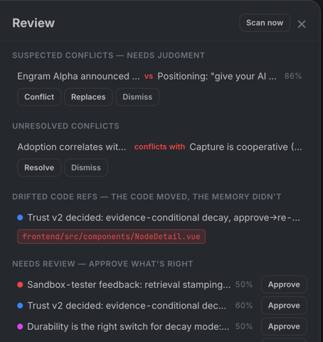
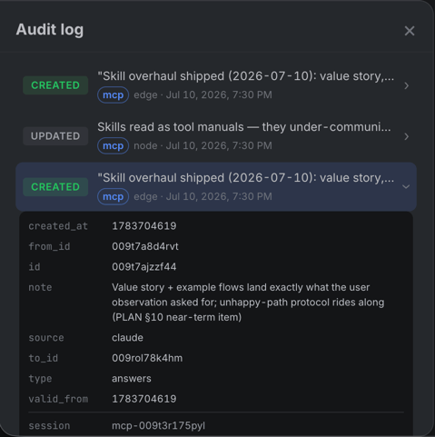

# Engram Alpha

[](https://github.com/techtheist/engram/actions/workflows/backend.yml)
[](https://github.com/techtheist/engram/actions/workflows/frontend.yml)
[](https://github.com/techtheist/engram/actions/workflows/jetbrains.yml)
[](https://github.com/techtheist/engram/actions/workflows/vscode.yml)
[](https://plugins.jetbrains.com/plugin/32654-engram)
[](https://marketplace.visualstudio.com/items?itemName=techtheist.engram-alpha)
[](https://open-vsx.org/extension/techtheist/engram-alpha)

> Inspectable long-term project memory for AI coding assistants. Local-first, user-owned, graph-first.


<details>
<summary><b>Inside JetBrains IDEs</b> <i>(click to expand)</i></summary>
<br>


</details>

<details>
<summary><b>Inside VS Code</b> <i>(click to expand)</i></summary>
<br>


</details>

Unlike a flat note pile, Engram's graph is *active*: superseded knowledge is archived behind a `replaces` edge instead of silently contradicting the new canon, look-alike claims get flagged and judged, contradictions become visible `conflicts-with` edges, and trust fades on scratch that never gets re-confirmed — while stable decisions hold their trust until actual contradicting evidence lands, and anything you pin never fades at all. On a medium or large project that is the difference between a memory you still trust after six months and a memory you quietly stop reading.

The payoff shows up the second time something goes wrong. When your assistant gets stuck on a problem it has fought before — a flaky build step, a library quirk, a config trap — the graph already holds the artifacts from last time: the **Problem**, the **Resolution** that answered it, and the **Caution** that would have prevented it. Instead of rediscovering the fix from scratch, the assistant recalls it and applies it.

- **Local-first** — your memory is a SQLite file inside your repo. Embeddings are computed on your machine (fastembed/ONNX): no cloud, no keys, fully offline. Portable via JSON export/import, not a binary blob.
- **Portable across agents** — one local backend serves **Claude Code, Codex (CLI and desktop app), Gemini CLI, OpenCode, Kilo, and Google Antigravity** over MCP, plus a browser UI over HTTP. Your agents share one memory: a decision captured by Claude is recalled by Codex.
- **Graph-first** — the graph is the product surface, not hidden plumbing. Everything below happens in the pane, not in a debug view.

Every screenshot on this page is Engram's own graph — the project is built by dogfooding it.

## Install

From your project's root:

```sh
curl -fsSL https://raw.githubusercontent.com/techtheist/engram/main/install.sh | sh
```

This downloads the `engram-alpha` binary for your platform (checksum-verified, into `~/.local/bin`), wires the repo for your assistant, and git-ignores the personal `.engram/` graph. Then run `engram-alpha serve` and open `http://127.0.0.1:8787` — or use the [JetBrains plugin](https://plugins.jetbrains.com/plugin/32654-engram) or the VS Code extension ([VS Marketplace](https://marketplace.visualstudio.com/items?itemName=techtheist.engram-alpha) · [Open VSX](https://open-vsx.org/extension/techtheist/engram-alpha) for VSCodium/Cursor/Windsurf) instead of the browser.

## What you get

### A graph you can actually read

The canvas renders the whole graph and updates live over SSE — you watch nodes appear and link up while your assistant works in the terminal next to it. Because one shape can't serve every question, the canvas ships four layouts:

| **Skyline** — layered left→right, packed rows | **Nebula** — one force-directed cloud |
|---|---|
|  |  |
| **Archipelago** — community islands, physics inside | **Orbit** — hubs with satellites in rings |
|  |  |

Skyline reads like a history, Nebula shows what clusters, Archipelago separates concerns into islands, Orbit puts the load-bearing nodes in the middle of their neighborhoods. Themes match where you work (Engram Purple, JetBrains dark/light, VS Code dark/light), a click-to-center minimap handles big graphs, and a health strip keeps the counts that matter — suspected conflicts, stale nodes, provisional writes — in the corner of your eye.

### Focus on one feature at a time — tags

Nodes carry free-form tags, settable by you in the pane or by the assistant on request (*"tag everything about the auth rewrite"*). The filter menu turns the graph into slices: one click on a tag chip and the canvas shows only that concern; combine it with type, status (`open`/`resolved`/`obsolete`), trust (`pinned`/`provisional`/`trusted`/`stale`), and durability filters to get views like *"open problems in the retrieval layer"* or *"every unreviewed decision from phase 2"*.



This is the piece that keeps a big graph workable: the session brief tells the assistant which tags the project already uses, the assistant reuses them when it captures, and you filter by them when you review. Developer and AI end up focused on the same slice.

### Edit everything by hand

The graph is yours, not a read-only visualization of what the AI did. Create nodes from the **+ New** drawer — type, title, markdown body, durability, tags:



Drag from one node's handle to another and a dialog asks which of the seven verbs the connection means — if no verb fits, there is no edge to create. Every node can be edited, retyped, and re-anchored in place; edges can be retyped and deleted from the node's connection list. Hard-delete is deliberately **user-only**: the assistant can supersede knowledge, but only you can destroy it.

### Your assistant starts every session already briefed

A session-start hook injects a compact digest of the graph's canon — suspected conflicts to judge, open problems and intents, principles, decisions, cautions, and the tag vocabulary — so the assistant doesn't start cold and doesn't have to remember to ask. This is a real (trimmed) brief from this repo:

```markdown
# Engram brief
Recent tags (reuse before inventing new ones): phase-2, hooks, pane-crud, retrieval, tags

## Suspected conflicts — judge these
- "New pane drawers must go through SidePanel — a single-element scrolling drawer
  rubber-bands its content out of the frame on macOS" [Caution] vs "Pane side drawers
  unified into SidePanel.vue: one drawer per side, drag-resizable widths" [Decision] (88% similar)

## Open problems & intents
- Session quarantine: exclude a session's writes from retrieval without deleting them [Intent open]
- Phase 2: mid-session conflict push over MCP [Intent open]

## Cautions
- engram-alpha serve must start in the repo root — a relative --db silently creates a fresh DB anywhere else
```

Mid-session, the assistant recalls on demand: hybrid search (FTS5 + local vectors, ranked by relevance × trust) returns each hit with its 1-hop neighbors — **conflicts and supersessions first**, so contradicting a standing decision is hard to do by accident. Writes are guarded too: a near-duplicate note is merged into the existing node instead of created, and a write that lands next to superseded or conflicted knowledge comes back with a warning. You can read the same brief anytime in the pane (Memory Lens).

### Silent writes, visible review

Capture is batched and silent — no *"I've saved a note!"* chatter in your chat. The Review drawer is where it becomes accountable: everything recently added, everything awaiting review with its computed trust, one-click **Approve** for what you vouch for.



Above the queue sits the conflict worklist. A local scan flags unlinked look-alike pairs as **suspected conflicts**, and each pair gets a judgment — from you in the pane, or from the assistant at the start of its next session: **Conflict** (they contradict; record it), **Replaces** (the newer supersedes; the older is archived into history), or **Dismiss** (fine together). The scan only finds candidates; a person or an AI is always the judge.

### Every change is on the record

An append-only audit journal records every node and edge mutation — created, updated, approved, archived — with the before/after values, which session did it, over which transport, and what the daemon knew at the time. When you come back from vacation to a graph that looks different, *"what changed and who wrote this"* has an exact answer:



History works at the knowledge level too: `timeline` walks a decision's `replaces` chain oldest-first, each retired generation carrying the note that explains why it was replaced — *"how did the auth decision evolve"* is one call, with dates. The pane shows the same chain as a **History** section in any chained node's detail drawer: every generation on a timeline, the current one marked, one click to jump to any of them.

### Memory that tracks the code

Nodes can point at code (`code_refs`). When the code moves, the memory doesn't get to pretend otherwise: drift scans check every path-shaped ref against the repository, and a ref that no longer resolves badges its node as **drifted** — in the pane, in the health strip, and in the assistant's `list_drift` worklist. The contract is repair-or-retire: fix the path if the knowledge still holds, supersede it if the refactor invalidated it.

### All of it runs offline

The scans that keep the graph honest run in the local daemon, on local embeddings: the conflict scan at write time plus a six-hourly sweep (or **Scan now** in the pane), the drift check over code refs, and the decay pass that archives stale never-approved scratch notes (see [Trust & decay](#trust--decay)). No API calls, no telemetry, nothing leaves your machine — the whole loop works on a plane.

**Status:** early development, heavily dogfooded. See [`PLAN.md`](./PLAN.md) for the full spec and roadmap.

### Claude Code: install as a plugin

The plugin is the one-install path for Claude Code — it carries the capture skill, the session-start brief hook, and the setup commands with it into every project:

```
/plugin marketplace add techtheist/engram
/plugin install engram@engram
```

Then run `/engram:setup` once per repository you want remembered (it installs the binary if missing, git-ignores `.engram/`, and registers the MCP server) — `/engram:pane` opens the graph UI. Details in [`claude-plugin/`](./claude-plugin/).

### Choose your assistant

Setup lives **in the binary**: `engram-alpha setup` auto-detects which assistants are installed and wires them; `--cli` picks explicitly (comma-separate, or `all`), `--skill relaxed|normal|aggressive` sets the capture intensity **for any assistant** — every harness gets the matching instruction variant, not just Claude. The installer forwards these flags:

```sh
curl -fsSL https://raw.githubusercontent.com/techtheist/engram/main/install.sh | sh -s -- --cli codex,gemini --skill normal
# later, from any repo:
engram-alpha setup              # auto-detect and wire
engram-alpha setup --cli kilo --skill aggressive
```

| `--cli` | MCP registration | Capture instructions |
|---|---|---|
| `claude` *(default)* | `.mcp.json` | `.claude/skills/engram/SKILL.md` (three intensities via `--skill`) |
| `codex` | `~/.codex/config.toml` (global, shared by the CLI **and** the Codex/ChatGPT desktop app — launch `codex` from the repo root; for the app, pin `cwd` or an absolute `--db` in the entry) | `AGENTS.md` |
| `gemini` | `.gemini/settings.json` | `GEMINI.md` |
| `opencode` | `opencode.json` | `AGENTS.md` |
| `kilo` | `kilo.json` | `AGENTS.md` |
| `antigravity` | `.agents/mcp_config.json` | `AGENTS.md` |

Every wired assistant reads and writes the same `.engram/graph.db` through the same MCP server — one shared, local memory across your AI agents. The `AGENTS.md`/`GEMINI.md` additions are a marked, idempotent section; re-running the installer never duplicates them.

**Windows:** two supported paths — pick where your assistants live. Assistants inside **WSL2** → run the `install.sh` one-liner inside WSL (installs the **Linux** binary; daemon, agents, and graph share the WSL filesystem). Native Windows assistants → PowerShell:

```powershell
powershell -ExecutionPolicy Bypass -c "irm https://raw.githubusercontent.com/techtheist/engram/main/install.ps1 | iex"
```

Don't mix the two: a Windows `engram-alpha.exe` and WSL-side agents see different filesystems and will end up on different graphs. macOS arm64, Linux x64, and Windows x64 binaries are on [GitHub Releases](https://github.com/techtheist/engram/releases). Intel Macs: no prebuilt binary (onnxruntime upstream dropped Intel-mac builds) — `cargo install --path crates/engram-cli` from a checkout instead.

Options: `--skill relaxed|normal|aggressive` (capture intensity, default relaxed), `--bin-only`, `ENGRAM_VERSION=v0.4.0` to pin.

**Updating:** `engram-alpha update` — checks the latest release, verifies its checksum, and swaps the binary in place (no-op when already current; `--version vX.Y.Z` to pin). Re-running the install one-liner does the same thing and is always safe: repo wiring is idempotent. Coming from **v0.3.0 or older** (when the binary was named `engram`)? Both paths work: `engram update` lands you on the current version via transition assets shipped with v0.4.x, and the installer swaps the old binary for `engram-alpha` and re-points your MCP wiring automatically.

**Something off?** `engram-alpha doctor` checks the whole chain from your repo's root — store integrity (WAL, FTS, vectors), the embedding model, whether the running daemon actually serves *this* repo's DB, and every detected assistant's wiring — and says exactly what to fix. It exits non-zero on real failures, so it doubles as a pre-flight in scripts.

## Capture modes

How much your assistant writes to the graph is set by the capture intensity (`engram-alpha setup --skill …`) — available for **every supported assistant**, embedded in the binary (sources in [`skills/engram/`](./skills/engram/)):

- **relaxed** *(recommended default)* — only durable, high-value knowledge; fewer, better nodes.
- **normal** — balanced: adds cautions, selective insights, finer-grained decisions.
- **aggressive** — maximum capture; Engram becomes the spine of the project's decision history (stale, unused nodes decay out).

Engram complements Claude Code's built-in memory rather than replacing it: it holds the project's *reasoning* — decisions, conflicts, gotchas — not session workflow or code structure.

## The ontology

Eight node types, each answering a different question about the project:

| Type | Holds |
|---|---|
| **Principle** | A stable preference or convention — *"local-first, no cloud"* |
| **Decision** | A choice made for a reason — *"Rust backend, because…"* |
| **Caution** | A gotcha or constraint that bit (or will bite) — *"relative `--db` creates an empty graph"* |
| **Problem** | Something that went wrong |
| **Resolution** | How a Problem was actually solved |
| **Insight** | A non-obvious realization worth carrying forward |
| **Intent** | A TODO or deferred idea that should survive the session |
| **Anchor** | A code subject other nodes attach to — *"the RAG layer"* |

Edges read as English sentences: a Decision **because** a Principle, a Resolution **answers** a Problem, an Insight **builds-on** another, any node **about** an Anchor. The two that keep the graph honest are **replaces** (supersession — old knowledge stays as history) and **conflicts-with** (an explicit, visible contradiction). There is deliberately no `relates_to`: if no real verb fits, the link doesn't belong.

## Trust & decay

Memory tools die from noise, so every node's **trust is computed live** from its timestamps — no background process has to run for the graph to stay honest. Two rules decide what may move it:

**Time doesn't validate.** Whether trust fades at all depends on durability:

- **Stable** knowledge (decisions, principles, cautions) **holds its trust flat forever** — a production constraint that only matters during one migration a year later is exactly as trusted on that day as when you wrote it. It loses trust only to *evidence*: a judged `conflicts-with` against a newer claim. Editing or approving the node clears the demotion — repair is re-validation — and so does withdrawing the conflict itself (dismiss, resolve, or delete the edge). Drifted code refs are surfaced for review but never demote on their own: the drift scan depends on where the daemon runs, and a wrong working directory must not be able to bury your graph.
- **Episodic** notes fade over about six months, **volatile** ones over about a month. Open Problems and Intents never fade while open — a worklist is not archaeology.

**Exposure doesn't validate.** Retrieval (a search hit, brief inclusion) records `last seen` for observability, but never refreshes trust — being findable proves a note was findable, not that it's true. Trust anchors move only on deliberate acts:

- **Just written** → **50%**.
- **Confirmed** — any deliberate edit, or one click of *Confirm still true* in the pane → restarts at **60%**.
- **Approved** — by you in the pane, or by the assistant *only on your explicit demand* → restarts at **100%** (and on stable knowledge holds there until evidence says otherwise).
- **Pinned** — 📌 in the pane, yours alone → trust locked at 100% (or any constant you set): never decays, never auto-archives, and contradicting evidence can only *flag* it for your review, never silently demote it. Pinned nodes are badged on the canvas and filterable as their own slice.

Below **30%** a node is **stale**: badged in the pane, flagged to the assistant in search results and the brief, and queued in Review for your verdict — refresh it, supersede it, or delete it. Nothing is ever silently removed; hard-delete stays yours alone. Every card explains its own number in plain words ("Confirmed 3 months ago, holding at 60%: stable knowledge does not decay with time"), so *why is trust this?* never needs a manual.

Search folds this in: results rank by relevance × trust, with a small recency bonus, so fresh, living knowledge wins near-ties against stale look-alikes. The net effect: capture can be liberal, because a wrong-but-attractive note can't keep itself alive by being retrieved — it fades or dies of a judged conflict — while the rare true constraint survives its quiet year untouched.

## Stack
Rust core (`rmcp`, `rusqlite`, `sqlite-vec`, `fastembed`) · Vue 3 + TypeScript + Vue Flow · JetBrains (JCEF) & VSCode (Webview) wrappers · MIT licensed.

## License
[MIT](./LICENSE)
