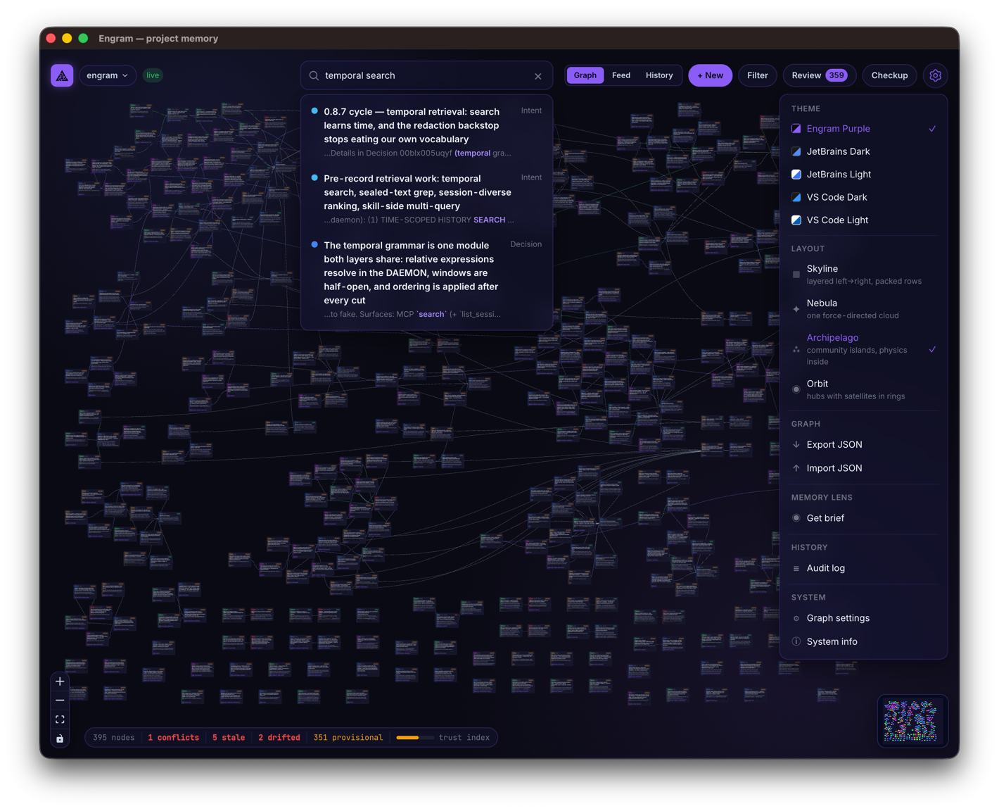
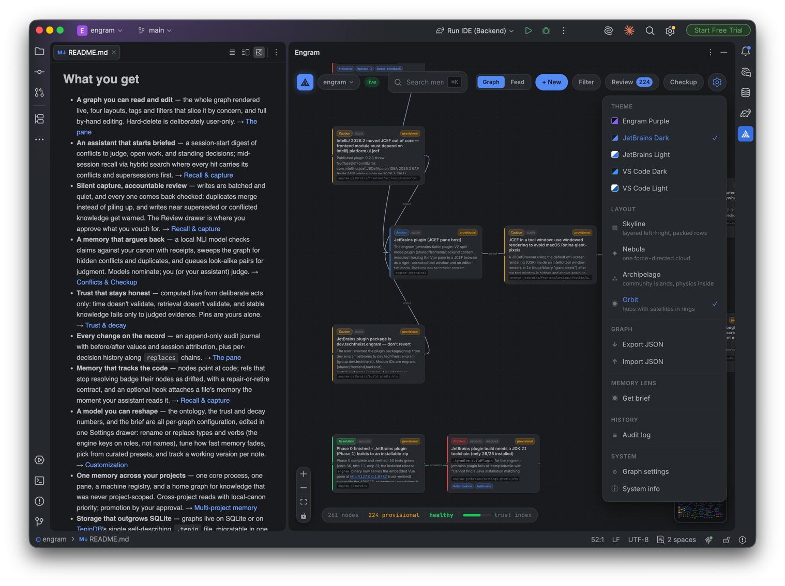
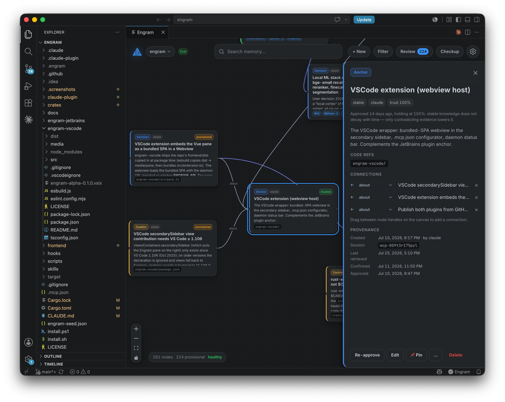
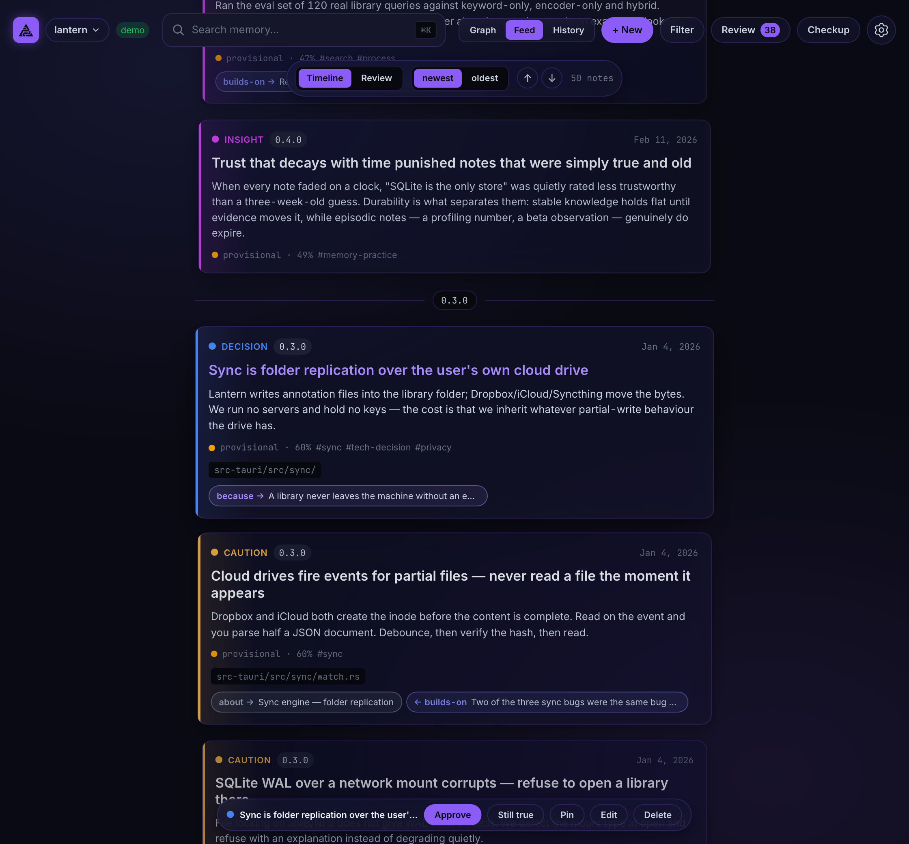

# Engram Alpha

[](https://github.com/techtheist/engram/actions/workflows/backend.yml)
[](https://github.com/techtheist/engram/actions/workflows/frontend.yml)
[](https://github.com/techtheist/engram/actions/workflows/jetbrains.yml)
[](https://github.com/techtheist/engram/actions/workflows/vscode.yml)
[](https://plugins.jetbrains.com/plugin/32654-engram)
[](https://marketplace.visualstudio.com/items?itemName=techtheist.engram-alpha)
[](https://open-vsx.org/extension/techtheist/engram-alpha)

> The most powerful and feature-rich inspectable long-term graph memory for software development with AI agents — built on reproducible research.

**[Open the live demo →](https://techtheist.github.io/engram/demo/)** — the real
pane, in your browser, over an invented project's memory. Nothing to install:
create notes, judge a conflict, retire a decision. Your edits stay in the tab.



<details>
<summary><b>Inside JetBrains IDEs</b> <i>(click to expand)</i></summary>
<br>


</details>

<details>
<summary><b>Inside VS Code</b> <i>(click to expand)</i></summary>
<br>


</details>

<details>
<summary><b>The timeline feed</b> <i>(click to expand)</i></summary>
<br>


</details>

Unlike a flat note pile, Engram's graph is *active*: superseded knowledge is
archived behind a `replaces` edge instead of silently contradicting the new
canon, look-alike claims get flagged and judged, contradictions become
visible `conflicts-with` edges, and trust fades on scratch that never gets
re-confirmed — while stable decisions hold their trust until contradicting
evidence lands, and anything you pin never fades at all. The payoff shows up
the second time something goes wrong: when your assistant meets a problem it
has fought before, the graph already holds the **Problem**, the
**Resolution** that answered it, and the **Caution** that would have
prevented it.

- **Local-first** — your memory is a file inside your repo. Embeddings and
  every scan run on your machine: no cloud, no keys, fully offline. Portable
  via JSON export/import, not a binary blob.
- **Portable across agents** — one local backend serves **Claude Code, Codex
  (CLI and desktop app), Gemini CLI, OpenCode, Kilo, Google Antigravity, and
  Windsurf** over MCP, plus a browser UI. Your agents share one memory: a
  decision captured by Claude is recalled by Codex.
- **Graph-first** — the graph is the product surface, not hidden plumbing.
  Reviewing, judging, and repairing memory all happen in the pane.

Every screenshot on this page is Engram's own graph — the project is built by
dogfooding it.

## Measured, not promised

The claims on this page have an instrument behind them. Engram ships its own
offline evaluation harness — an invented-subject corpus nothing can answer
from pretraining, substring grading with no LLM judge, seeded and
reproducible — and since 0.8.0 the product's retrieval defaults are outputs
of benchmark runs, with the runs published next to the code:

- **~9× the recall per token of a conventional vector stack.** At 1,500
  realistic notes, Engram answers from ~300 delivered tokens per query what
  pure-vector RAG needs ~2,700 for — at equal recall@5, ahead on the
  phrasing-weighted headline (0.93 vs 0.91), with over half of every
  delivery being the answer itself (focus 0.52 vs rag's 0.10).
- **Where a maintained memory file loses, measured — not asserted.** A
  3,000-token CLAUDE.md is whole below ~40 notes and overtaken by retrieval
  at 100; an unusually diligent 30,000-token one genuinely wins recall up to
  ~200 notes, then falls off its capacity cliff by 500. The file never loses
  on quality — only on capacity, and now there's a table saying exactly
  where.
- **Attention metrics the field doesn't publish.** Every result table pairs
  recall with `focus` (what share of the delivered tokens was the answer)
  and `noise` (how much of the delivery was false positives). A full-context
  dump scores recall 1.00 and focus 0.004 on the same run — *present* and
  *readable* are different claims, and only one of them is usually measured.
- **Honesty is calibrated, not vibes.** The floor that trims weak results
  and the `strong` / `weak` / `none` confidence verdict on every search
  reply were chosen by sweeping them against measured recall,
  false-positive, and attention columns — including the negative result:
  hard abstention was measured, priced, and rejected because it costs real
  answers.
- **Superseded knowledge stays out of the answer — measured, with an
  ablation.** ADR-shaped history (the same decision re-decided three times,
  each generation `replaces`-ing the last): the shipped stack returns the
  current answer with **zero** retired generations delivered and the history
  one link away; the identical store without supersession delivers a retired
  generation on 88% of questions and lets the current one win the ranking
  only 59% of the time. Flat files and pure RAG cannot make this distinction
  at all — the table is in [`eval/`](./eval/README.md).
- **Tested on an external corpus, not just our own.** The harness runs
  [LongMemEval](./eval/LONGMEMEVAL.md) (real multi-session chat histories,
  evidence labels, MIT) as-is — no LLM anywhere in ingestion or grading —
  under a chat ontology defined purely as per-graph data. Full population,
  all 500 questions: rag's recall@1 matched at 8% of its delivered tokens
  (208 vs 2,654/query), and the 30 never-answerable questions drew **zero**
  confident answers — on data we did not write.
- **Rejected mechanisms stay on the record.** The harness documents what was
  tried and didn't survive measurement — graph spreading activation, a
  deciding cross-encoder, deeper reranking — because a benchmark that only
  reports wins is an advertisement.

Method, tables, and the honest caveats: [`eval/`](./eval/README.md); the
external-corpus run has [its own page](./eval/LONGMEMEVAL.md). Next on the
bench: the online half (live models answering from each arm's delivered
context — including the official LongMemEval answer protocol) and competitor
memory systems run as arms on the same corpus.

## Install

From your project's root:

```sh
curl -fsSL https://raw.githubusercontent.com/techtheist/engram/main/install.sh | sh
```

Then `engram-alpha serve` and open `http://127.0.0.1:8787` — or use the
[JetBrains plugin](https://plugins.jetbrains.com/plugin/32654-engram) / VS
Code extension instead of the browser. Claude Code users can install
everything as a plugin: `/plugin marketplace add techtheist/engram`. Windows,
per-assistant wiring, and updating: [Getting started](./docs/getting-started.md).

## What you get

- **A graph you can read and edit** — the whole graph rendered live, four
  layouts, tags and filters that slice it by concern, and full by-hand
  editing. Hard-delete is deliberately user-only. → [The pane](./docs/pane.md)
- **A timeline you can scroll** — the second screen renders the same memory
  as a vertical feed: the project's story in order with version markers, a
  review lens for what needs an eye, edge-hopping with a back-trail, and
  judgment actions right on the centered card. → [The pane](./docs/pane.md)
- **An assistant that starts briefed** — a session-start digest of conflicts
  to judge, open work, and standing decisions; mid-session recall via hybrid
  search where every hit carries its conflicts and supersessions first.
  → [Recall & capture](./docs/recall-and-capture.md)
- **Silent capture, accountable review** — writes are batched and quiet, and
  every one comes back checked: duplicates merge instead of piling up, and
  writes near superseded or conflicted knowledge get warned. The Review
  drawer is where you approve what you vouch for.
  → [Recall & capture](./docs/recall-and-capture.md)
- **A memory that argues back** — a local NLI model checks claims against
  your canon with receipts, sweeps the graph for hidden conflicts and
  duplicates, and queues look-alike pairs for judgment. Models nominate;
  you (or your assistant) judge. → [Conflicts & Checkup](./docs/conflicts-and-checkup.md)
- **Retrieval that knows its own confidence** — weak tail hits are trimmed
  by a benchmark-calibrated floor, and every search reply carries a
  `strong` / `weak` / `none` verdict so your assistant verifies uncertain
  memory and admits silence instead of inventing it. Past 200 notes, the
  graph re-calibrates its conflict threshold from your own judgment
  history. → [Measured, not promised](#measured-not-promised)
- **Trust that stays honest** — computed live from deliberate acts only:
  time doesn't validate, retrieval doesn't validate, and stable knowledge
  falls only to judged evidence. Pins are yours alone.
  → [Trust & decay](./docs/trust.md)
- **Every change on the record** — an append-only audit journal with
  before/after values and session attribution, plus per-decision history
  along `replaces` chains. → [The pane](./docs/pane.md)
- **Memory that tracks the code** — nodes point at code; refs that stop
  resolving badge their nodes as drifted, with a repair-or-retire contract,
  and an optional hook attaches a file's memory the moment your assistant
  reads it. → [Recall & capture](./docs/recall-and-capture.md)
- **A model you can reshape** — the ontology, the trust and decay numbers,
  and the brief are all per-graph configuration, edited in one Settings
  drawer: rename or replace types and verbs (the engine keys on roles, not
  names), tune how fast memory fades, pick from curated presets, and track a
  working version per note. → [Customization](./docs/customization.md)
- **One memory across your projects** — one core process, one pane, a
  machine registry, and a home graph for knowledge that was never
  project-scoped. Cross-project reads with local-canon priority; promotion
  by your approval. → [Multi-project memory](./docs/multi-project.md)
- **Storage that outgrew SQLite** — graphs live on
  [TepinDB](https://github.com/tepindb/tepindb)'s single self-describing
  `.tepin` file by default; a graph still on SQLite migrates itself on first
  open, audit journal intact, with the `.db` left behind as your backup —
  and the file is inspectable with `npx tepindb` even while Engram is
  running. → [Storage & TepinDB](./docs/storage.md)
- **Local models you choose** — embeddings, reranker, and NLI run offline
  and are swappable from the pane (presets or any compatible ONNX export by
  URL); an embedding swap re-embeds your graphs in one guarded pass.
  → [Local models](./docs/models.md)

## The memory model

Eight node types (Principle, Decision, Caution, Problem, Resolution,
Insight, Intent, Anchor) and seven edge verbs that read as sentences — a
Decision **because** a Principle, a Resolution **answers** a Problem, the
newer **replaces** the older, two claims **conflict-with** each other. Three
capture intensities (`relaxed` / `normal` / `aggressive`) set how much your
assistant writes. It's the shipped default, and the one most projects should
keep — but every part of it is [yours to reshape](./docs/customization.md).
→ [The memory model](./docs/memory-model.md)

## Documentation

All user documentation lives in [`docs/`](./docs/README.md) — install and
wiring, the memory model, trust, the pane, conflicts, multi-project memory,
the [runtime architecture](./docs/runtime.md), storage, local models, and
troubleshooting (`engram-alpha doctor` diagnoses the whole chain;
`engram-alpha status` shows what's running; `engram-alpha stop` halts
everything cleanly).

Security posture: [`SECURITY.md`](./SECURITY.md). The roadmap lives in the
project's own memory graph — dogfooding is the spec. **Status:** early
development, heavily dogfooded, benchmark-driven — retrieval changes cite a
measured run or they don't ship.

## Stack

Rust core (`rmcp` — stdio + daemon-hosted streamable HTTP, `rusqlite` +
`sqlite-vec` with a [TepinDB](https://github.com/tepindb/tepindb) backend
behind the same storage trait, `fastembed` — local ONNX embeddings +
reranker + NLI, all user-swappable; no LLM ever runs in the daemon) · Vue 3
+ TypeScript + Vue Flow · JetBrains (JCEF) & VSCode (Webview) wrappers.

## License

[MIT](./LICENSE)
