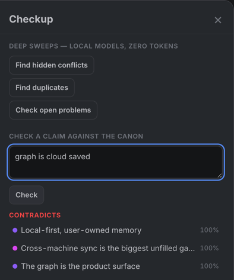

# Conflicts & Checkup

A memory you can trust has to notice when it disagrees with itself. Engram
runs that noticing locally, on small local models, under one strict rule:
**models nominate, people judge**. No model output ever moves a trust score
or changes the graph on its own.

## Suspected conflicts

A local scan — at write time, six-hourly in the daemon, or on demand with
**Scan now** — flags unlinked look-alike pairs as *suspected conflicts*.
Each pair waits for a judgment, from you in the Review drawer or from the
assistant at the start of its next session:

- **Conflict** — they genuinely contradict; a visible `conflicts-with` edge
  records it (and starts the evidence-based trust demotion on stable
  knowledge — see [Trust & decay](./trust.md)).
- **Replaces** — the newer supersedes the older; the older is archived into
  the node's history, readable forever, never silently in the way.
- **Dismiss** — fine together; the pair is never raised again.

Suspects carry a triage hint from the local NLI model (contradiction /
entailment / neutral), which orders the queue — contradiction-hinted pairs
first — but never decides anything. When the model reads a contradiction as
lopsided, the hint also names which side likely carries the negation ("the
older side"), so you know where to look first.

## Checkup: interrogate the canon

Beyond finding what the graph *says*, the **Checkup** panel asks whether it
*agrees*. It runs a small local NLI model (natural-language inference —
entailment / neutral / contradiction) over your own knowledge: zero tokens,
fully offline.

Type a claim and the canon answers with receipts. A real run against this
repository's graph: the claim *"graph is cloud saved"* comes back
**contradicts**, listing the principles that disagree — local-first,
user-owned — each one click from its full node. A claim the canon *supports*
lists its backing nodes the same way. And **silent** is an answer too:
nearby nodes with no verdict means the graph simply doesn't know — usually
something worth capturing.

Above the claim box, one-click sweeps over the whole graph:

- **Find hidden conflicts** — look-alike pairs the model reads as
  contradictions.
- **Find duplicates** — pairs that state the same thing; judge as Replaces
  to merge their histories.
- **Check open problems** — does an existing Decision or Resolution already
  answer an open Problem? Pairs that are already linked another way are
  flagged as such rather than re-suggested blindly.
- **Triage stale notes** — for each note whose trust has decayed, what the
  live canon suggests: *reconfirm* (something current still backs it — one
  click restores its trust), *contradicted* (the canon now disputes it —
  judge it as a conflict), or *isolated* (nothing current speaks to it — a
  candidate to archive).

Below, instant structural checks with no models at all: Decisions missing a
recorded reason, nodes with no connections. Everything a sweep finds lands
as a *nomination* in the Review drawer.

## The assistant's side

Your assistant has the same power as the `check_claim` MCP tool — *"does the
canon contradict this plan?"* before acting, no tokens spent — and every
write it makes comes back with the full verdict set in the same turn (see
[Recall & capture](./recall-and-capture.md#writes-come-back-as-verdicts)).

One honesty note: the similarity thresholds behind the conflict scan were
calibrated on the default embedding model. If you
[switch embedding models](./models.md), detection quality is unvalidated
until re-tuned — the pane says so where you switch.
