# The pane

The graph is the product surface, not hidden plumbing. The pane renders the
whole graph, updates live over SSE while your assistant works, and is where
every review and repair gesture lives. It runs in the browser at
`http://127.0.0.1:8787`, inside JetBrains IDEs (tool window or editor tab),
and in VS Code's secondary sidebar.

## Three layouts

One shape can't serve every question, so the canvas ships three:

| **Skyline** — layered left→right, packed rows | **Archipelago** — community islands, physics inside |
|---|---|
| 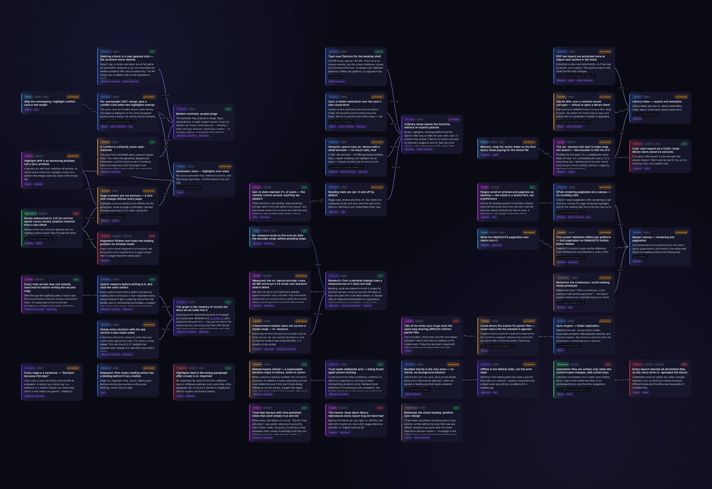 | 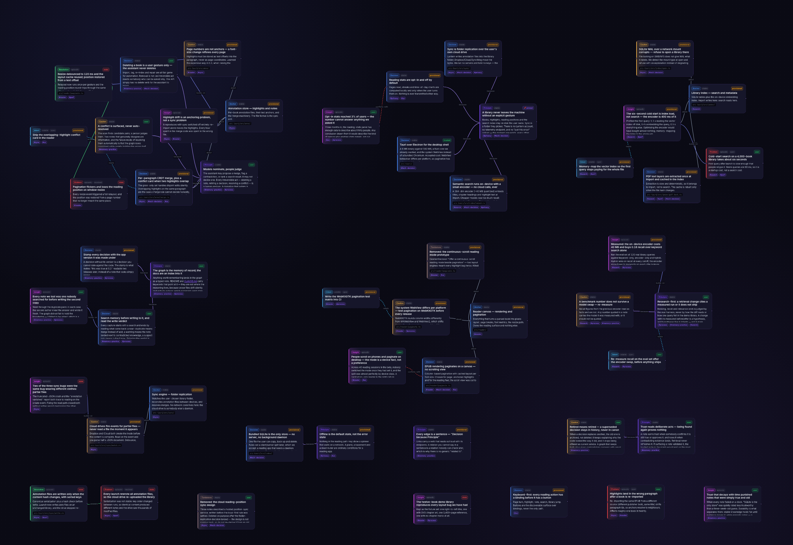 |
| **Orbit** — hubs with satellites in rings | |
| 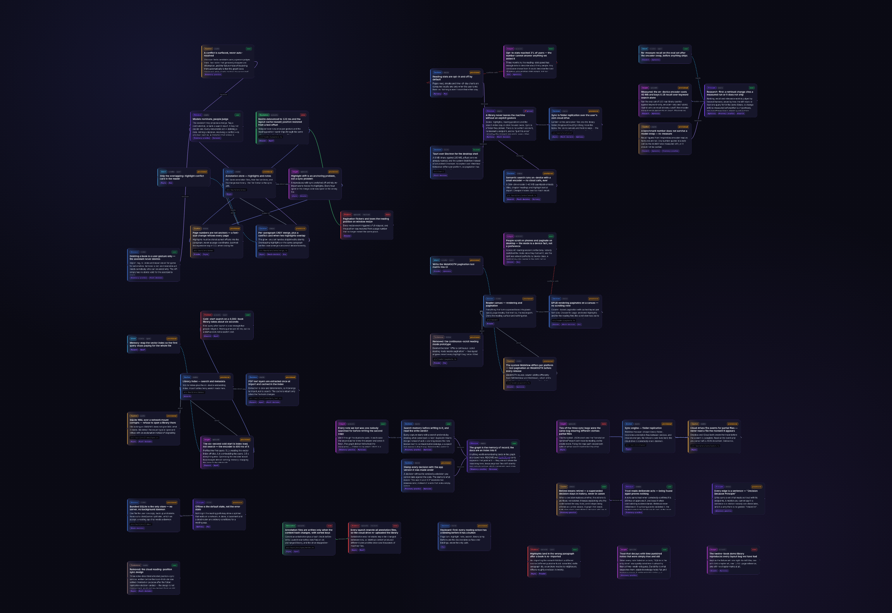 | |

Skyline reads like a history, Archipelago separates concerns into islands,
Orbit puts the load-bearing nodes in the middle of their neighborhoods. Themes match where you work (Engram Purple,
JetBrains dark/light, VS Code dark/light), a click-to-center minimap handles
big graphs, and a health strip keeps the counts that matter — suspected
conflicts, stale nodes, provisional writes — in the corner of your eye.

## The timeline feed

The **Graph / Feed** toggle in the topbar switches to the pane's second
screen: the same memory as a vertical feed of cards, neighbors peeking above
and below so you always see where you are in the stream.

Two lenses over the same feed:

- **Timeline** — everything in chronological order, with version markers
  wherever the project's
  [working version](./customization.md) moved on. History reads as a story:
  the problem, the decision that answered it, the caution it left behind.
- **Review** — only what needs a human eye (provisional, stale, drifted),
  ordered weakest trust first, with the judgment actions inline.

Every card shows its full markdown clipped to a fixed preview; the card you
stop on opens to its whole body, however long — scroll inside it, then move
on (`j`/`k` and the arrow keys navigate too, and **↑ / ↓** in the toolbar
jump to the ends of the feed). Cards carry what the node is about: version,
status and drift badges, its computed trust (or a **stale** badge, the same
one the Review drawer uses), its tags, the code files it cites — struck
through where the file no longer exists — and its date, which spells out
creation and last retrieval on hover. The bottom bar carries the
side drawer's actions for whichever card is centered — **Approve / Still
true / Pin / Edit / Delete** — so a review pass never leaves the feed.

The feed also *traverses*: click any edge chip on a card and the feed jumps
to that node — even one the current lens filters out — while **← back**
walks the trail home (session-scoped, forty hops deep). And the two screens
share one notion of "current": select a node on the canvas and the feed
opens centered on it; leave the feed and the canvas selects and centers the
card you were reading.

## Starting from empty

An empty graph shows one card on either screen: what will fill it, how to
fill it now (`/engram:digest`, or *"digest this project"* — see
[Seeding an existing project](./memory-model.md)), and an **Ontology**
picker. An empty graph is the one moment a
[preset](./customization.md) can be applied with nothing to retype, so the
choice lives where you meet it — pick one, press Save, and every later write
speaks that vocabulary.

## Sessions, as they were recorded

The third screen of the topbar toggle is the **History** screen — the
optional [session-history layer](./storage.md), off until you turn it on. Its
harvester reads your assistants' own transcripts into a sibling store (sealed
at rest by default), and the screen reads them back: every recorded session
in the left rail with its harness, date and turn count, the conversation
itself beside it, and **Delete session** for anything that shouldn't have
been kept.

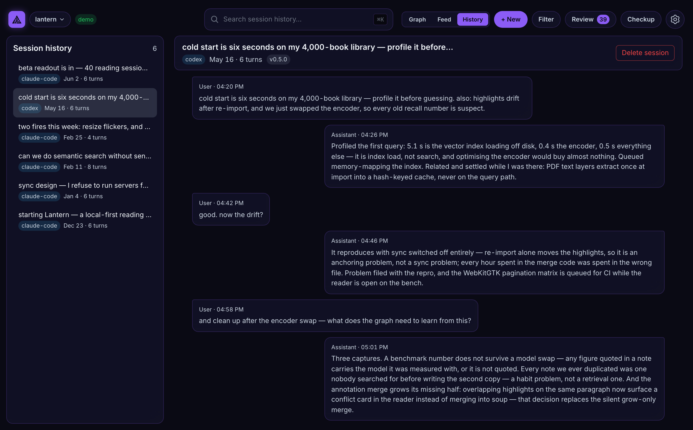

Transcripts never enter the graph. They stay a labeled fall-through under
search, and the link runs both ways: a note carries the session it was born
in, and a session lists the notes born in it.

## Tags and filters

Nodes carry free-form tags, settable by you in the pane or by the assistant
on request (*"tag everything about the auth rewrite"*).

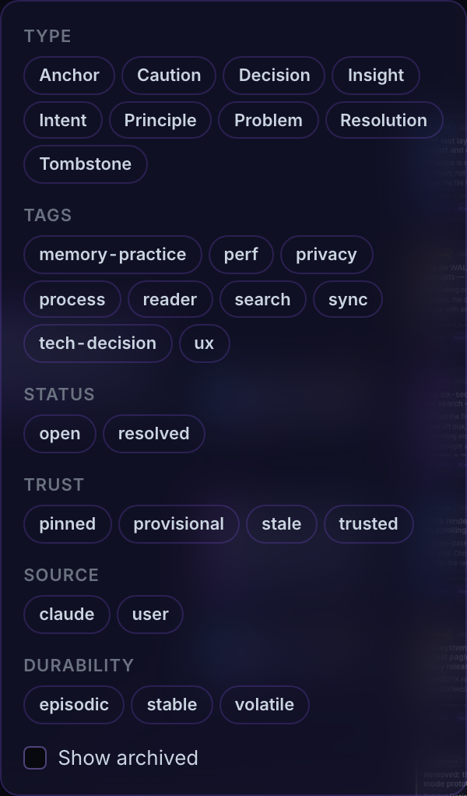

The filter menu turns the graph into slices: one click on a tag chip and the
canvas shows only that concern. Combine tags with type, status
(`open`/`resolved`/`obsolete`), trust (`pinned`/`provisional`/`trusted`/
`stale`), and durability filters for views like *"open problems in the
retrieval layer"* or *"every unreviewed decision from phase 2"*.

Retired knowledge is filtered out by default: a node that has been
superseded or decayed away is history, not canon — it stays one **Show
archived** click away, and always reachable through its successor's History
section.

Tags are also how you and the assistant stay on the same page: the session
brief lists the project's tag vocabulary, the assistant reuses it when
capturing, and you filter by it when reviewing.

## Edit everything by hand

The graph is yours, not a read-only visualization of what the AI did.
Selecting a node opens everything the graph knows about it — badges, tags,
custom field values, body, links, and the session it was born in — with
every one of them editable in place.

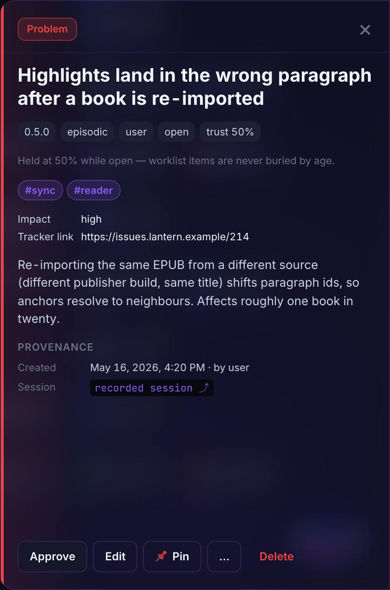 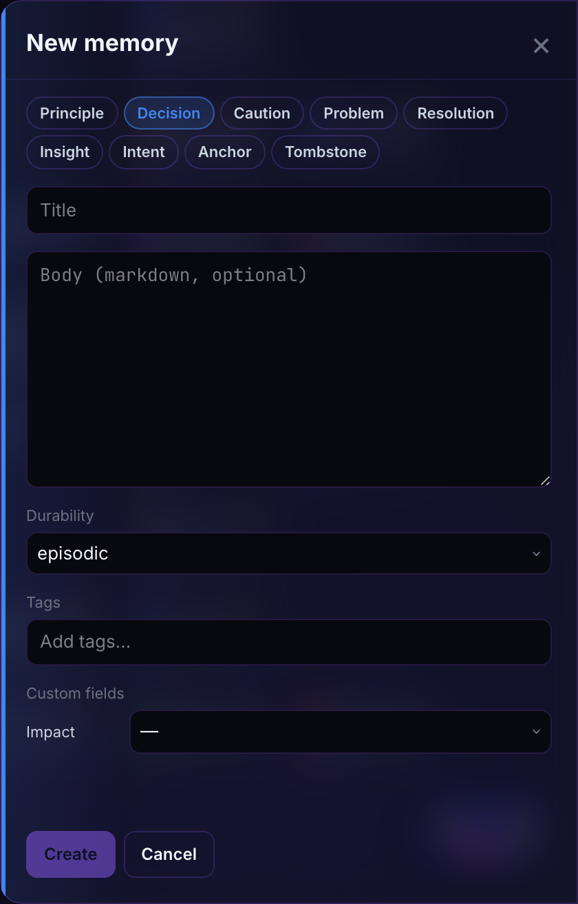

- **Create** nodes from the **+ New** drawer — type, title, markdown body,
  durability, tags, and any [custom fields](./customization.md#custom-fields)
  the graph declares (required ones marked).
- **Link** by dragging from one node's handle to another; a dialog asks
  which of the seven verbs the connection means. If no verb fits, there is
  no edge to create.
- **Edit, retype, re-anchor** any node in place — custom field values
  included; retype or delete edges from the node's connection list.
- **Hard-delete is user-only** by design: the assistant can supersede
  knowledge — and since 0.9.2 bury it behind a Tombstone of its own — but
  only you can destroy it. The delete confirm offers to **leave a
  Tombstone** (on by default, with an optional reason) — a record of what
  was removed and why, so no future session innocently re-learns it. By
  default the Tombstone **keeps the removed text** (body, tags, code refs),
  which is what lets a later rewrite of the same content land on it and
  draw the assistant's `tombstoned` warning; untick that to purge the text
  and keep only what was removed and why. The victim's `about` edges move
  onto the Tombstone, so the removal stays attached to the code subject it
  happened under.

  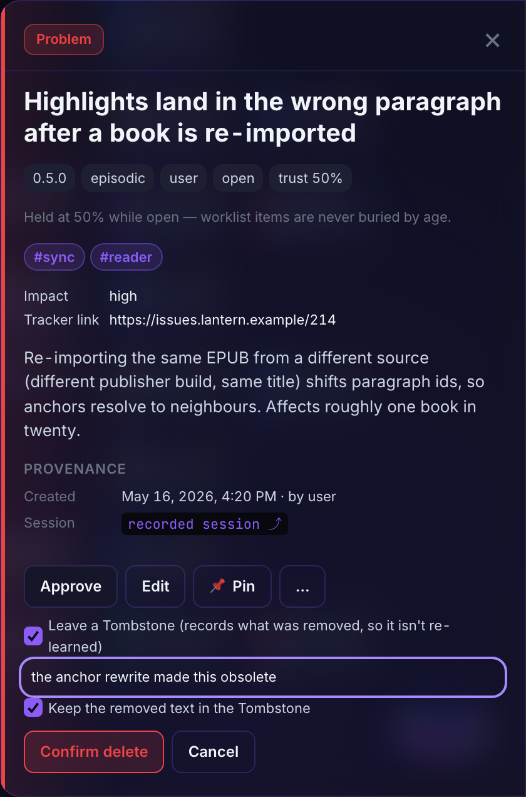

## The Review drawer

Capture is silent; Review is where it becomes accountable.

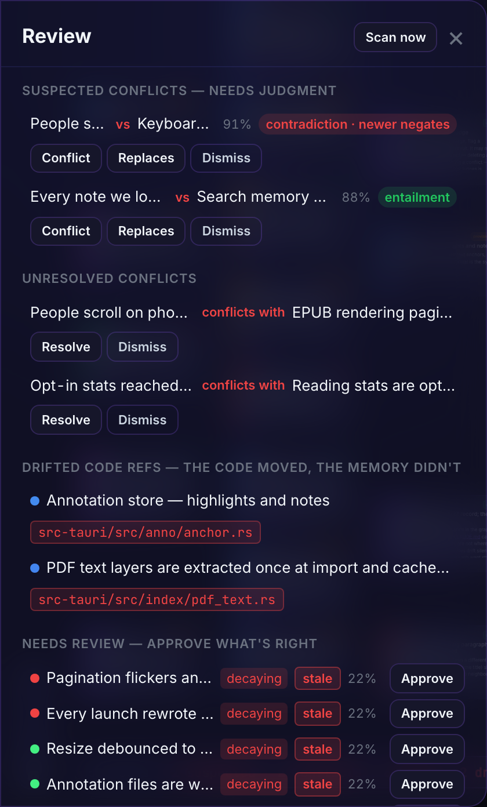

Everything recently added, everything awaiting review with its computed
trust, one-click **Approve** for what you vouch for — and above the queue,
the conflict worklist: suspected look-alike pairs awaiting your
**Conflict / Replaces / Dismiss** verdict (see
[Conflicts & Checkup](./conflicts-and-checkup.md)).

## Every change on the record

An append-only audit journal records every node and edge mutation — created,
updated, approved, archived — with before/after values, which session did
it, over which transport, and what the daemon knew at the time.

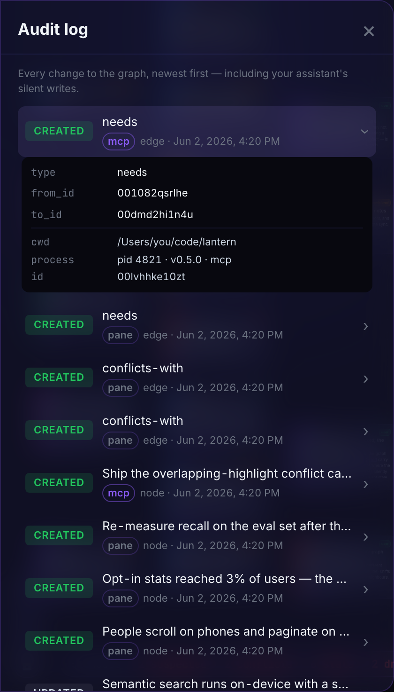

When you come back from vacation to a graph that looks different, *"what
changed and who wrote this"* has an exact answer.

## History at the knowledge level

Any node in a `replaces` chain shows a **History** section in its detail
drawer: every generation on a timeline, oldest first, the current one
marked, each retired generation carrying the note that explains why it was
replaced — one click to jump to any of them. The assistant gets the same
chain through the `timeline` tool: *"how did the auth decision evolve"* is
one call, with dates.

## Settings → System

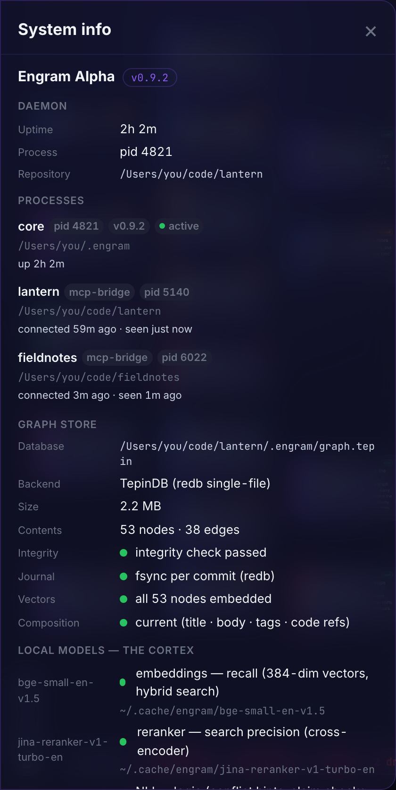

The System panel is the daemon's self-report: binary version and uptime,
store backend and integrity, the loaded
[local models](./models.md) with their on-disk paths and the
**Choose models** selector, the machine
[project registry](./multi-project.md), and per-assistant wiring status.
Since 0.8.8 it also lists the [processes](./runtime.md): the machine core
(pid, version, uptime) and every connected MCP client with its project
folder and connection age, from the same live census `engram-alpha status`
reads — plus whether the models are loaded or idle-unloaded. Since 0.9.0 it
carries the two **At-rest encryption** switches (encrypt graph — off by
default; encrypt history — on by default): flipping one migrates the whole
store with a progress readout, and each store's recorded state is shown
beside its switch. See [SECURITY.md](../SECURITY.md) for what sealing does
and doesn't protect.
